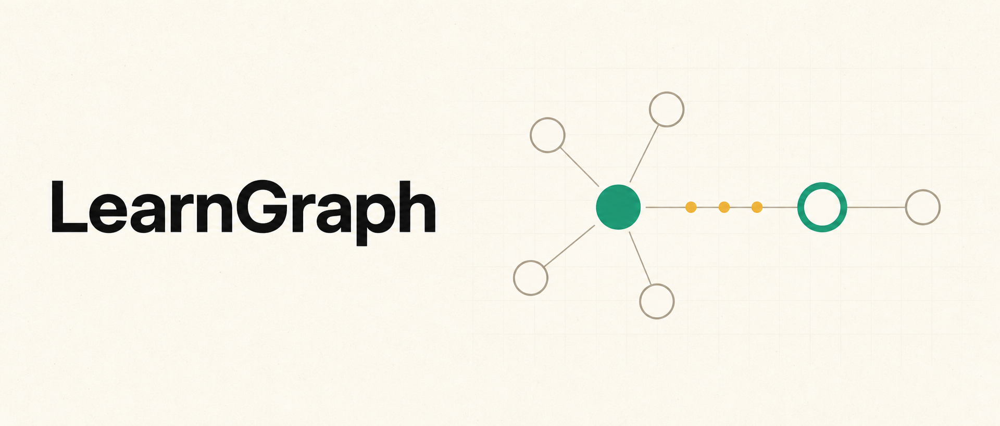
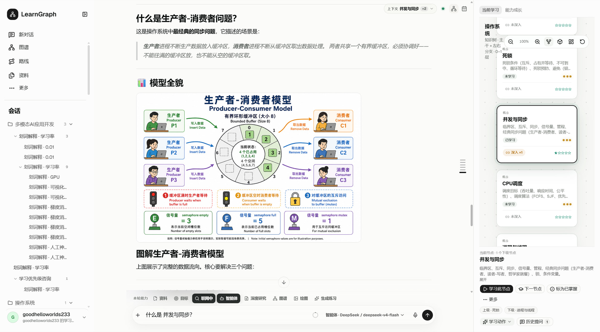
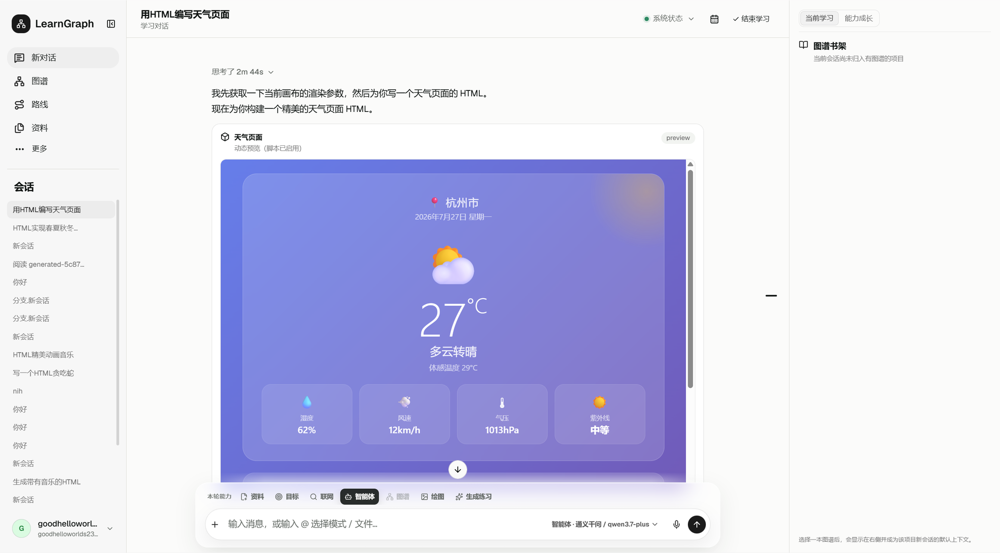
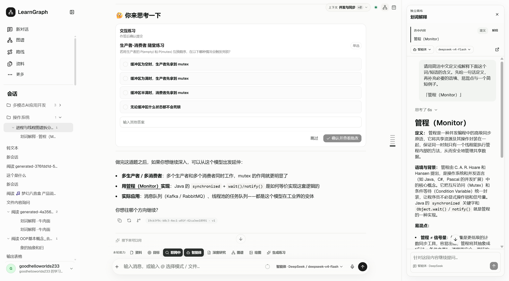
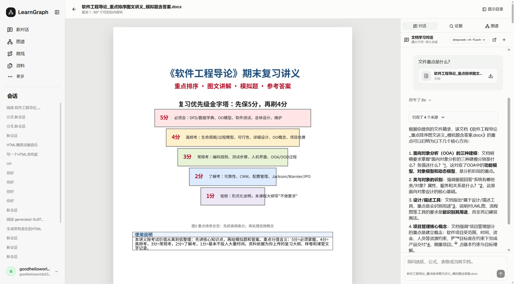

<p align="center">
  
</p>

<h1 align="center">LearnGraph</h1>

<p align="center">
  <strong>让人从 AI 学习，高效进入并掌握陌生领域。</strong>
</p>

<p align="center">
  从一个真实目标出发，获得一张随学习持续生长的知识路线图
</p>

<p align="center">
  
  
  
  
  <a href="https://sunnyboy-y.github.io/LearnGraph/"></a>
  <a href="./LICENSE"></a>
</p>

<p align="center">
  <a href="#-为什么是-learngraph">核心特色</a> ·
  <a href="#-产品截图">产品截图</a> ·
  <a href="#-一次完整的学习旅程">学习旅程</a> ·
  <a href="#-当前能力">当前能力</a> ·
  <a href="#-后续规划">后续规划</a> ·
  <a href="#-快速开始">快速开始</a> ·
  <a href="#-技术架构">技术架构</a> ·
  <a href="https://sunnyboy-y.github.io/LearnGraph/">开发者文档</a> ·
  <a href="https://github.com/SunnyBoy-y/LearnGraph">GitHub</a>
</p>

> [!IMPORTANT]
> LearnGraph 目前处于早期开发阶段，适合本地体验、研究和共同开发，请勿用于生产环境。

## 🖼 产品截图

<table>
  <tr>
    <th width="50%">主对话页面</th>
    <th width="50%">可交互web组件生成</th>
  </tr>
  <tr>
    <td></td>
    <td></td>
  </tr>
  <tr>
    <th>随心练习速览解释</th>
    <th>文档学习与溯源问答</th>
  </tr>
  <tr>
    <td></td>
    <td></td>
  </tr>

</table>

## 📚 开发者文档

开发者文档详细说明当前项目的系统架构、API 网关、Agent Runtime、渐进式工具披露、Tools、Skills、MCP、Docker 沙箱、安全边界与真实验收规范。

- [在线阅读开发者文档](https://sunnyboy-y.github.io/LearnGraph/)

文档站由 GitHub Pages 自动发布。仓库内的 `docs/` 与 `backend/docs/` 仍是仅供本地开发使用的内部资料，不会进入 Git 或 Pages 部署产物。

## ✨ 为什么是 LearnGraph

LearnGraph 围绕“**人如何从 AI 学习**”而构建。面对一个陌生领域，用户只需说出真实目标，AI 便会帮助梳理领域结构、识别关键概念、建立知识之间的联系，并把复杂的学习过程组织成清晰可行的路线。

在这条路线中，Agent 会结合知识图谱、个人资料与联网信息，主动编排对话、检索、练习、解释和实践等学习任务。用户可以更快建立对陌生领域的整体认知，在持续反馈中理解概念、验证掌握并完成真实应用。

### 四个核心特色

| | 特色 | 能为用户带来什么 |
| --- | --- | --- |
| 🌱 | **可生长的知识路线图** | 从一句真实目标出发，快速看清陌生领域的知识全貌、学习顺序和当前重点；随着理解加深，路线会结合新资料与学习进展持续调整。 |
| 🤖 | **Agent 级学习智能** | 获得一位能够主动规划和执行的 AI 学习伙伴：它会寻找资料、组织解释、设计练习并调用合适工具，帮助用户把时间集中在理解、思考和实践上。 |
| 🧭 | **证据驱动的双图谱** | 随时看清“目标还需要什么”和“自己已经会什么”，每次对话、作答、解释与实践都能沉淀为成长依据，让学习进度具体、可信、可复盘。 |
| 🔎 | **人在回路的可信成长** | 用户始终掌握学习路线和重要判断的决定权，并能查看结论背后的来源与证据，在清晰、可审核的过程中稳步拓展能力边界。 |

## 🪴 一次完整的学习旅程

1. **说出目标**：用自然语言描述想学什么、为什么学以及时间约束，系统动态澄清真正影响路线的关键信息。

2. **审核路线**：LearnGraph 生成初始目标图谱，由用户确认节点、前置关系、范围和优先级后发布。

3. **与 Agent 一起学习**：围绕单个或多个节点展开对话，结合个人文件、来源检索、练习与工具执行完成学习任务。

4. **让证据推动成长**：对话、作答、解释和实践产出沉淀为带来源的证据，持续更新能力状态、置信度与复习风险。

5. **获得下一步行动**：系统结合目标权重、知识前置关系、能力缺口和时间安排，推荐当前最值得投入的学习行动。

```text
真实目标与资料 → 目标澄清 → 初始目标图谱 → 用户审核
       ↑                                      ↓
用户审核路线更新 ← 下一步行动 ← 能力图谱变化 ← Agent 学习与证据
```

## 🔄 G-R-E-M-A 学习闭环

| 阶段 | 产出 | LearnGraph 如何处理 |
| --- | --- | --- |
| **G · Goal** | 结构化目标 | 澄清真实学习目标，保留用户确认与约束 |
| **R · Representation** | 目标图谱 | 生成可审核、可修订、带版本的知识结构 |
| **E · Evidence** | 证据记录 | 将学习行为与产出转换为带来源的可追溯证据 |
| **M · Mastery** | 能力状态 | 基于证据解释掌握状态、置信度与复习风险 |
| **A · Action** | 下一步行动 | 综合目标权重、前置关系、能力缺口和时间形成推荐 |

目标图谱和能力图谱是 LearnGraph 的两个长期视图：

- **目标图谱**记录为了目标需要学习的知识结构，重要更新经过用户审核；
- **能力图谱**记录用户实际形成的能力，由练习、解释和实践等可追溯证据持续驱动。

## ✅ 当前能力

| 领域 | 已接入的产品与代码能力 |
| --- | --- |
| **目标与图谱** | Goal 澄清与确认、候选图谱审核、目标图谱、能力图谱与图谱工作台 |
| **学习对话** | Session、Message/MessagePart、SSE 流、消息版本、分支和结构化消息渲染 |
| **资料与来源** | 文件上传、解析状态、本地对象存储、文档学习、联网来源与引用 |
| **证据与行动** | Evidence、Mastery、练习、作答反馈、复习风险和下一步行动相关流程 |
| **Agent 与扩展** | 模型、搜索、研究、MCP、Storage 等 Provider 边界；按当前模式、角色和授权按需装配工具；支持沙箱能力探测与受控执行 |
| **渐进式工具** | 先向模型提供能力地图，再按需展开工具契约；工具采用原子动作、JSON Schema 参数校验、服务端权限复核、结果裁剪和审计，未授权能力明确不可用 |
| **沙箱执行** | Docker-only 隔离的 Agent Workspace，默认断网，按会话与用户隔离；支持受限文件读写、列举、命令执行、转录和产物发布，具备配额、超时、幂等、审计与 SSE 状态回传 |
| **工作区治理** | 登录、Membership、RBAC/ACL、用量、审计、迁移预检和工作区设置 |

## 🗺 后续规划

- **更多主流模型适配**：持续扩展文本、视觉、推理、图片生成和语音模型，让不同学习任务可以匹配更合适的模型能力。
- **可更换的 Agent 内核**：在统一的 Goal、Graph、Evidence、Mastery 和 Action 契约之上接入不同 Agent Runtime，支持按场景选择和演进智能体内核。
- **桌面端与移动端**：围绕连续学习体验建设桌面客户端和移动客户端，让路线、资料、对话、练习与复习跨设备衔接。
- **更丰富的学习工具生态**：继续完善 Skills、MCP、可信组件、文档学习和研究能力，让 Agent 可以组合更多专业工具完成真实学习任务。
- **更完整的端到端验收**：持续覆盖跨模块浏览器场景、真实远程 Provider、权限边界和完整 Agent 学习闭环。

面向贡献者的工程优先级、已完成基线与验收条件见[开发者文档](https://sunnyboy-y.github.io/LearnGraph/)（仓库内 `ROADMAP.md` 已不再随版本发布）。其中 P2 是计划中的受限扩展，并不表示当前已提供；沙箱默认拒绝网络是当前已完成的安全基线。

当前版本以 Web 应用为主要入口，远程模型、联网搜索、网页抓取、研究、ASR 等能力需要配置对应 Provider。沙箱相关功能还需要 Docker。

## 🚀 快速开始

### 环境要求

| 工具 | 版本 |
| --- | --- |
| Node.js | 20+ |
| npm | 10+ |
| Python | 3.11+ |
| [uv](https://docs.astral.sh/uv/) | 最新稳定版 |
| Docker | 可选，仅沙箱能力需要 |

### 安装并启动

```bash
git clone https://github.com/SunnyBoy-y/LearnGraph.git
cd LearnGraph
npm run dev:install
```

`dev:install` 会在前端或后端缺少 `.env` 时，自动从对应的 `.env.example` 创建本地配置；已有 `.env` 会原样保留。随后脚本按照 `frontend/package-lock.json` 和 `backend/uv.lock` 安装依赖，并联合启动前后端。后续可直接运行：

```bash
npm run dev
```

| 服务 | 默认地址 |
| --- | --- |
| Web | `http://127.0.0.1:5173` |
| API | `http://127.0.0.1:8000` |
| OpenAPI | `http://127.0.0.1:8000/docs` |
| Health | `http://127.0.0.1:8000/api/v1/health` |

需要修改端口时：

```bash
npm run dev -- --frontend-port 5174 --backend-port 8001
```

### 通过 FRP / 内网穿透访问

开发模式默认由 Vite 把 `/api` 以及 WebSocket 代理到本机后端，因此常规页面功能只暴露 `5173` 即可，不需要把 `8000` 也暴露到公网。

| 本地端口 | 是否需要公网映射 | 用途 |
| --- | --- | --- |
| `5173` | 必需，已映射 | Vite 前端、同源 `/api`、SSE、实时听写 WebSocket |
| `8001` | 使用交互式子应用/卡片时需要 | 独立 subapp preview 源，必须映射到另一个公网端口 |
| `8000` | 可选 | 仅当需要公网直接访问 OpenAPI/API 时；普通页面由 `5173` 代理 |

以当前 `https://frp-sea.com:23350` 为例，再把本地 `8001` 映射为公网 `23351`，启动：

```bash
npm run dev -- \
  --public-origin https://frp-sea.com:23350 \
  --preview-public-origin https://frp-sea.com:23351
```

如果 FRP 客户端不在运行服务的这台机器上，需要让服务监听局域网/外部地址，再额外加 `--lan`，或在 `frontend/.env` 设置 `LEARNGRAPH_LISTEN_HOST=0.0.0.0`。FRP 客户端在同一台机器上时默认的 `127.0.0.1` 绑定即可工作。

也可以在环境文件中配置：`frontend/.env` 填 `LEARNGRAPH_PUBLIC_ORIGIN`，`backend/.env` 填 `LEARNGRAPH_SUBAPP_PREVIEW_ORIGIN`。Vite 会自动允许公网 Host；`scripts/dev.mjs` 会自动把公网源加入 CORS，并把 subapp 预览 URL 切换成公网源。

脚本使用 Node.js 编排，在 Windows、macOS 和 Linux 上使用相同命令。当前发布整理已在 Windows 上完成实际检查；macOS/Linux 建议在发布前通过 CI 或目标设备复核。

### 首次登录

空数据库首次启动时会创建 `admin` 管理员，并只在后端控制台打印一次高强度临时密码。首次登录后请立即修改密码。

默认配置不会创建 Demo 身份，也不会启用本地演示模型。如需显式开发演示，可在本地 `.env` 中单独开启，并与真实功能验收区分。

<details>
<summary><strong>本地配置文件说明</strong></summary>

`npm run dev` 和 `npm run dev:install` 每次启动时都会检查 `frontend/.env` 与 `backend/.env`。缺失文件会从同目录的 `.env.example` 自动创建，已经存在的文件不会被修改或覆盖。需要自定义配置时，直接编辑生成的本地 `.env` 即可。

Provider API Key 默认由操作系统安全凭据库保护。首次在页面保存 API Key 时会自动生成版本化主密钥，无需在 `.env` 中配置 `LEARNGRAPH_MASTER_KEY`。托管部署可显式选择 `environment` 兼容模式并注入高熵主密钥。

</details>

## 🧩 渐进式工具与沙箱执行

LearnGraph 不会把所有工具一次性暴露给模型，而是根据当前模式、用户角色、工作区授权和可用 Provider，先编译能力地图，再按需加入具体工具契约。每个工具都对应一个可验证的原子动作：参数使用 JSON Schema 校验，服务端会再次检查作用域与 Grant，并对结果进行裁剪、持久化和审计。没有授权或运行条件不足时，能力会明确标记为不可用，不会静默回退到宿主机。

Agent 需要执行代码、处理文件或生成产物时，使用 Docker-only 的 Agent Workspace。沙箱按聊天会话和属主用户隔离，默认断网，容器采用只读根文件系统、非 root 用户、能力 drop、超时和资源配额。支持受限文件读写、文件列举、脚本执行、音频转录桥接和产物发布；命令状态、退出码、截断、Artifact 与审计信息可通过持久化记录和 SSE 回传。Docker、镜像 digest 或配置不满足时，系统返回明确的 unavailable 状态，绝不在宿主机执行。

## 🏗 技术架构

```text
Browser / React 19 + TypeScript + Vite
├─ React Router · TanStack Query · React Flow
├─ Streamdown / AI Elements
└─ ApiClient: Bearer + X-Workspace-ID + JSON/SSE
                         │
                         ▼
FastAPI /api/v1
├─ routers: HTTP/SSE 契约、认证、权限与错误边界
├─ services: Goal、Graph、Chat、File、Learning 等用例
├─ repositories: 工作区作用域的数据访问
└─ provider ports
   ├─ local: 文件存储
   └─ remote: 模型、搜索、抓取、研究、Mem0、MCP
                         │
                         ▼
SQLAlchemy 2 · SQLite · local filesystem
```

SQLite 是当前 MVP 的规范业务事实源。SSE 负责传输，Session、Message、MessageVersion、MessagePart 和事件仍会持久化。前端统一访问 LearnGraph 后端，由服务端完成认证、工作区授权、Provider 调用和事实写入。

<details>
<summary><strong>查看仓库结构</strong></summary>

```text
LearnGraph/
├─ frontend/             React + TypeScript + Vite
│  └─ src/
│     ├─ api/            领域 API 与统一客户端
│     ├─ features/       页面和业务交互
│     ├─ components/     UI、图谱与消息渲染
│     └─ types/          前端领域类型
├─ backend/
│  └─ app/
│     ├─ api/routers/    HTTP/SSE 路由
│     ├─ services/       业务用例
│     ├─ repositories/   数据访问
│     ├─ providers/      Ports 与适配器
│     └─ domain/         模型与 Schema
├─ developer-docs/       可公开部署的开发者 HTML 文档
├─ scripts/              跨平台启动与检查脚本
└─ .github/assets/       README 公共素材
```

</details>

## 🧪 开发与检查

| 命令 | 作用 |
| --- | --- |
| `npm run dev` | 使用已有依赖联合启动前后端 |
| `npm run dev:install` | 从锁文件安装依赖并启动 |
| `npm run check` | 前端 lint/生产构建 + 后端语法/应用导入检查 |
| `npm run check:install` | 从锁文件安装依赖后执行全部检查 |
| `npm run check:frontend` | 仅执行前端检查 |
| `npm run check:backend` | 仅执行后端检查 |
| `npm run build:frontend` | 构建前端生产产物 |

`npm run dev` 会从 5173 开始自动选择第一个可用的前端端口，终端会显示实际地址。公共代码快照不包含内部开发文档、测试夹具或浏览器产物，因此 `npm run check` 不代表真实 E2E 或远程 Provider 验收已经完成。

涉及模型、搜索、研究或关键业务流程的发布，还应使用真实配置、真实 HTTP/SSE 和真实浏览器操作完成验证。

## 🔐 安全与可信边界

- `X-Workspace-ID` 是作用域提示；后端会重新校验 Membership、权限与资源范围。
- Provider Secret 由后端加密保存，不进入浏览器、日志、SSE、审计或导出。
- 模型、搜索、研究和沙箱能力均采用显式可用性状态，调用结果与失败边界可以追踪。
- Docker 沙箱不可用时返回明确状态，宿主机不会成为隐式执行环境。
- 数据库、上传内容、缓存、构建产物与真实凭据均由 Git 排除。
- 学习资产面向 Markdown、JSON 等开放格式导出，支持长期持有和迁移。

## 🤝 参与贡献

欢迎在 [SunnyBoy-y/LearnGraph](https://github.com/SunnyBoy-y/LearnGraph) 提交 [Issue](https://github.com/SunnyBoy-y/LearnGraph/issues) 或 Pull Request。

修改前请沿完整数据流核对页面、API、权限、服务、持久化与 Provider 边界；涉及 AI、搜索或研究时，请清楚标注是否完成真实远程 Provider 验收。新增功能需要保持来源、权限、事务、审计和用户审核边界的一致性。

## 📄 License

LearnGraph 基于 [MIT License](./LICENSE) 开源。

## 🙏 鸣谢

感谢 [CC-Switch](https://github.com/farion1231/cc-switch) 的开源贡献。本项目的 GitHub Copilot 接入，以及 Baidu Qianfan Coding Plan、火山 Agentplan、OpenRouter、Longcat、Kimi、Kimi For Coding、ModelScope 和 Xiaomi MiMo 快捷配置参考了 CC-Switch 的供应商预设与适配工作。

## 友情链接
学AI上L站！

https://linux.do/
